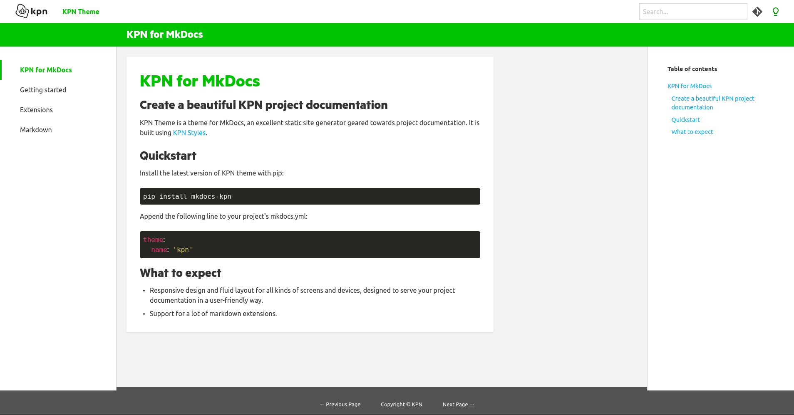
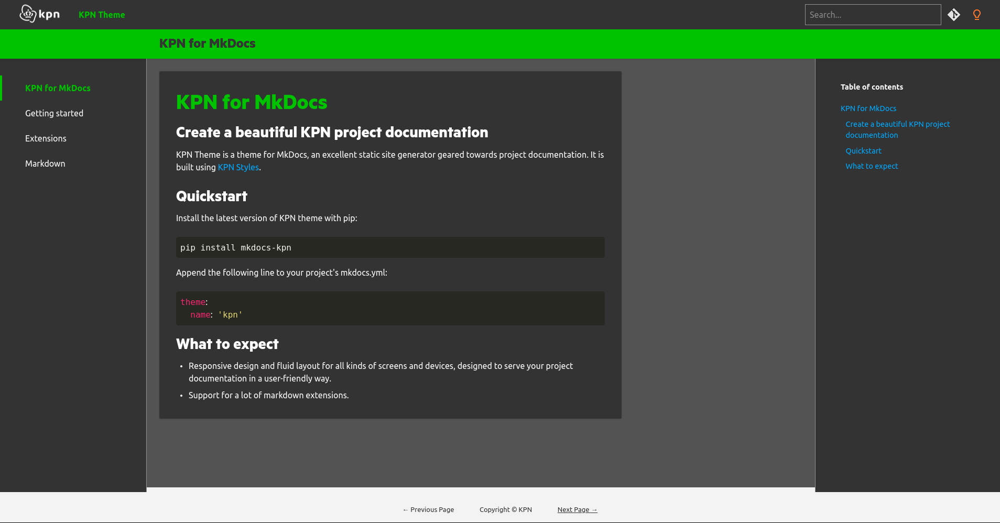

# KPN for MkDocs

[](https://conventionalcommits.org)
[](https://pypi.org/project/mkdocs-kpn/)





## Create a beautiful KPN project documentation

KPN Theme is a theme for MkDocs, an excellent static site generator geared towards project documentation.
It is built using [KPN Styles][kpn_styles].

## Quickstart

Install the latest version of KPN theme with pip:

```bash
pip install mkdocs-kpn
```

Append the following line to your project's mkdocs.yml:

```yaml
theme:
  name: 'kpn'
```

## What to expect

- Responsive design and fluid layout for all kinds of screens and devices,
designed to serve your project documentation in a user-friendly way.
- Support for a lot of markdown extensions.

## Change repo icon

```yaml
# options: github | gitlab | bitbucket | gitea
extra:
  repo_icon: 'github'
```

## Add version to site

Edit `mkdocs.yml` with

```yaml
extra:
  version:
    provider: 'manual'
    version: 1.2.2
```

[kpn_styles]: https://style.kpn.com/
